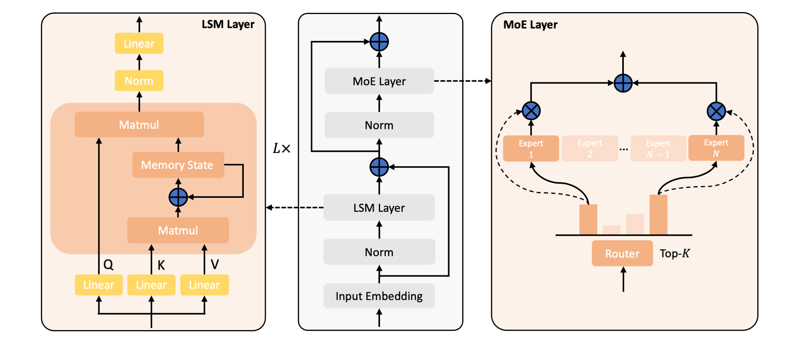
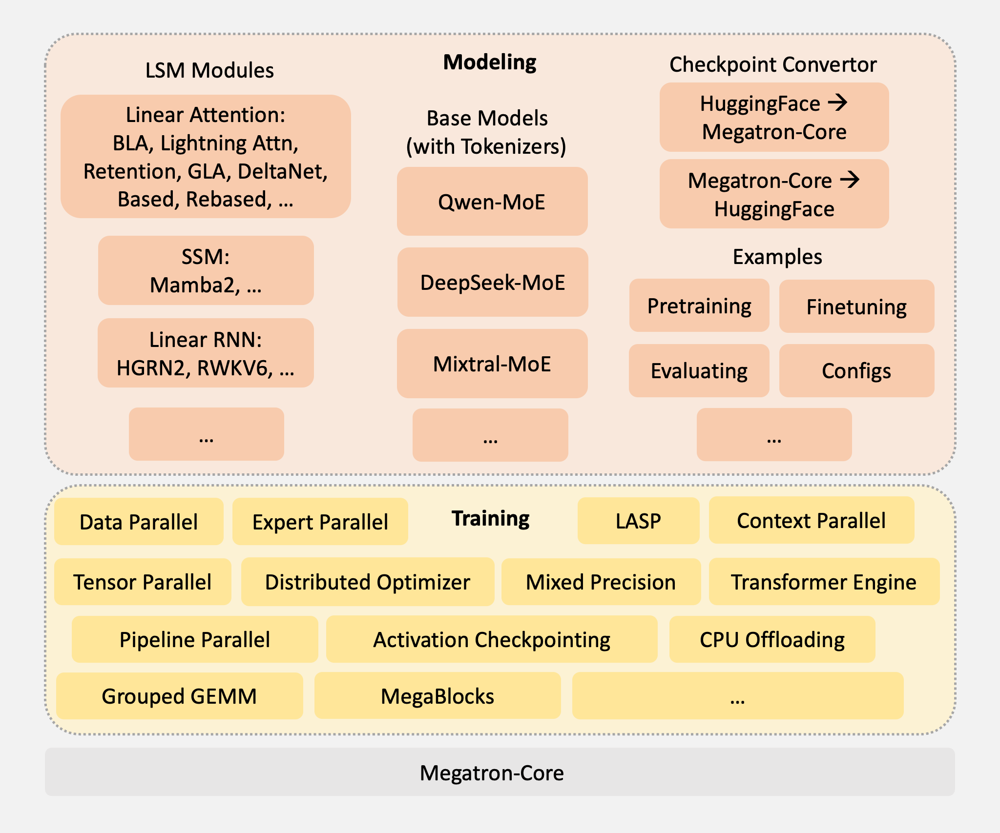

<div align="center">

# Linear-MoE
[](https://arxiv.org/abs/2503.05447)
[](https://github.com/OpenSparseLLMs/Linear-MoE/stargazers)

</div>

This repo aims to provide a **production-ready library** for modeling and training Linear-MoE models, non-invasively built on the latest [Megatron-Core](https://github.com/NVIDIA/Megatron-LM). **Contributions through pull requests are highly encouraged!**

<!-- It supports state-of-the-art open-source Mixture of Experts (MoE) models, seamlessly integrated with advanced linear sequence modeling techniques such as Linear Attention, State Space Modeling, and Linear RNN. LInear-MoE is still under development, **Contributions through pull requests are highly encouraged!** -->

# Model Matrix

|   Linear Sequence Modeling  |  Instance  |  Qwen2 MoE (@Alibaba)  |    Deepseek v2 MoE (@Deepseek)       |    Mixtral MoE (@Mistral AI)   | Llama3 (@Meta)   |
| :---: | :---: | :---: | :---: | :---: | :---: |
| Linear Attention (LA) |       [Basic Linear Attention](https://arxiv.org/abs/2006.16236) <br> (@Idiap@EPFL)  | ✅ |    ✅    |   ✅   | ✅   |
|  |       [Lightning Attention](https://arxiv.org/abs/2405.17381) <br> (@Shanghai AI Lab)       | ✅ |          ✅          |     ✅      | ✅   |
|  |       [Retention](https://arxiv.org/abs/2307.08621) <br> (@MSRA@THU)       | ✅ |          ✅          |     ✅      | ✅   |
|  |         [GLA](https://arxiv.org/abs/2312.06635)  <br> (@MIT@IBM)         | ✅ |     ✅      |    ✅       | ✅   |
|  |           [Delta Net](https://arxiv.org/abs/2102.11174) <br> (@MIT)            | ✅ |    ✅    |     ✅      | ✅   |
|  |           [GSA](https://arxiv.org/abs/2409.07146) <br> (@SUDA@MIT)      | ✅ |    ✅    |     ✅      | ✅   |
|  | [Based](https://arxiv.org/abs/2402.18668) <br> (@Stanford) | ✅ |      ✅      |      ✅     |  ✅   |
|  |            [Rebased](https://arxiv.org/abs/2402.10644) <br> (@Tinkoff)            | ✅ |  ✅  |      ✅     | ✅   |
|  |            [LASP-2](https://arxiv.org/abs/2502.07563) <br> (@Shanghai AI Lab)            | ✅ |  ✅  |      ✅     | ✅   |
|  |            [Gated DeltaNet](https://arxiv.org/abs/2412.06464) <br> (@MIT@NVIDIA)            | ✅ |  ✅  |      ✅     | ✅   |
|  |            [🔥MoM (with GLA)](https://arxiv.org/abs/2502.13685) <br> (@Shanghai AI Lab)            | ✅ |  ✅  |      ✅     | ✅   |
|  |            [🔥MoM (with Gated DeltaNet)](https://arxiv.org/abs/2502.13685) <br> (@Shanghai AI Lab)            | ✅ |  ✅  |      ✅     | ✅   |
| State Space Modeling (SSM) |             [Mamba2](https://arxiv.org/abs/2405.21060) <br> (@Princeton@CMU) | ✅ | ✅  |   ✅   | ✅   |
| Linear RNN |             [RWKV6](https://arxiv.org/abs/2404.05892) <br> (@RWKV)              |  ✅  |   ✅   |    ✅    | ✅   |
|  |             [HGRN2](https://arxiv.org/abs/2404.07904) <br> (@TapTap@Shanghai AI Lab)             | ✅ |   ✅   |   ✅   |  ✅   |
| Softmax Attention |             [Softmax Attention](https://arxiv.org/abs/1706.03762) <br> (@Google)             | ✅ |   ✅   |   ✅   |  ✅   |
|  |             [FlashAttention-2](https://arxiv.org/abs/2307.08691) <br> (@Princeton@Stanford)             | ✅ |   ✅   |   ✅   |  ✅   |


# Overview

<p align="center">
  
</p>
<div align="center">
Linear-MoE Architecture
</div>

&nbsp;

<p align="center">
  
</p>
<div align="center">
Linear-MoE System: Modeling and Training
</div>

# Installation

Your environment should satisfy the following requirements:

- [PyTorch](https://pytorch.org/) >= 2.0
- [Triton](https://github.com/openai/triton) >=2.2

## Virtualenv

```bash
# create a conda env, install PyTorch
conda create -n linear-moe python=3.11
conda activate linear-moe
conda install pytorch pytorch-cuda=12.1 -c pytorch -c nvidia

# (if needed) Apex
git clone https://github.com/NVIDIA/apex.git
pip install -v --disable-pip-version-check --no-cache-dir --no-build-isolation --config-settings "--build-option=--cpp_ext" --config-settings "--build-option=--cuda_ext" ./

# (if needed) FlashAttention
MAX_JOBS=8 pip install flash-attn --no-build-isolation

# (if needed) dropout_layer_norm in FlashAttention
git clone https://github.com/Dao-AILab/flash-attention.git
cd flash-attention/csrc/layer_norm & pip install .

# Transformer Engine
pip install git+https://github.com/NVIDIA/TransformerEngine.git@stable

# Linear-MoE 
git clone --recurse-submodules https://github.com/OpenSparseLLMs/Linear-MoE.git

# requirements
pip install -r requirements.txt
```


## Container
We recommend using the latest release of [NGC's PyTorch container](https://ngc.nvidia.com/catalog/containers/nvidia:pytorch) with DGX nodes, which already have relatively new versions of CUDA, cuDNN, NCCL, PyTorch, Triton, Apex, TransformerEngine, etc., installed.

On the top of NGC's PyTorch container, you can setup Linear-MoE with:
```bash
# Linear-MoE 
git clone --recurse-submodules https://github.com/OpenSparseLLMs/Linear-MoE.git

# requirements
pip install -r requirements.txt
```


# Usage

## Pretraining or Finetuning

<!-- **Key Features related to pretraining in Linear-MoE**
- Multiple linear sequence modeling options (Linear Attention, SSM, Linear RNN)
- Flexible MoE configurations
- Multi-node distributed training
- Mixed precision training
- Gradient checkpointing
- Token dropping for efficient MoE training -->

To pretrain or finetune a Linear-MoE model, you can:

1. Open `examples`, choose the model you are going to pretrain or finetune, e.g. `linear_moe_qwen2`.

2. Edit `run_pretrain_qwen.sh` or `run_finetune_qwen.sh` to set your configurations including:
- Model size (e.g., 0.5B, 1.5B, 7B)
- Batch size
- Learning rate
- Model architecture (e.g., LSM modules, number of experts)
- Distributed training settings (TP, PP, CP, EP sizes)
- ...

3. **Start pretraining or finetuning** by: `sh run_pretrain_qwen.sh` or `sh run_finetune_qwen.sh`.

For example, to train a A0.3B (hybrid) `linear-moe-qwen2` model with `LA_MOUDLE=hgrn2`, you can config `run_pretrain_qwen.sh` as:
```bash
ENV=dsw
MODEL_SIZE=A0.3B
BATCH_SIZE=2
GLOBAL_BATCH_SIZE=4
LR=1e-4
MIN_LR=1e-5
SEQ_LEN=2048
PAD_LEN=2048
PR=bf16
TP=1
PP=1
CP=1
EP=1
AC=sel
DO=true
FL=false
FU=false
SP=false
TE=false
MB=false
USE_GEMM=false
TOKEN_DROPPING=false
TRAIN_CAPACITY_FACTOR=1.25
EVAL_CAPACITY_FACTOR=2.0
SAVE_INTERVAL=100000
DATASET_PATH=xxx/qwen-datasets/wudao_qwenbpe_text_document
PRETRAIN_CHECKPOINT_PATH=xxx/qwen-ckpts/Qwen2-0.5B
TRAIN_TOKENS=15000000000
WARMUP_TOKENS=10000
OUTPUT_BASEPATH=./output

LA_MODULE="hgrn2"
BASE_MODEL="qwen2"

# for linear attention and linear RNN models
# pure linear
# LAYER_TYPE_LIST="LLLLLLLLLLLL"
# hybrid model
LAYER_TYPE_LIST="LLLNLLLNLLLN"

# for SSM models (Mamba2), MLP layers are fixed behind mamba or attention layers. 
# M: mamba layer, *: attention layer
# pure mamba2
# HYBRID_OVERRIDE_PATTERN="MMMMMMMMMMMM"
# hybrid mamba2
# HYBRID_OVERRIDE_PATTERN="MMM*MMM*MMM*"

# Linear Attention & Linear RNN
linear_moe_options=" \
        --use-la-module \
        --la-module ${LA_MODULE} \
        --la-mode fused_chunk \
        --base-model ${BASE_MODEL} \
        --la-feature-map swish \
        --la-output-norm rmsnorm \
        --la-gate-fn swish \
        --layer-type-list ${LAYER_TYPE_LIST} \
        "

# # SSM
# linear_moe_options=" \
#         --use-la-module \
#         --la-module ${LA_MODULE} \
#         --base-model ${BASE_MODEL} \
#         "
```


## Evaluation

We use [EleutherAI/lm-evaluation-harness](https://github.com/EleutherAI/lm-evaluation-harness) for benchmark evaluation. See [eval/README.md](eval/README.md) for detailed instruction.


# Acknowledgement
We built this repo upon [alibaba/PAI-Megatron-Patch](https://github.com/alibaba/Pai-Megatron-Patch), and take [Megatron-Core](https://github.com/NVIDIA/Megatron-LM) as the training engine. We use the triton-implemented linear attention kernels from [fla-org/flash-linear-attention](https://github.com/fla-org/flash-linear-attention), and CUDA implemented Mamba2 kernel from [state-spaces/mamba](https://github.com/state-spaces/mamba) to accelerate the execution.

# Citation
If you find this repo useful, please consider citing our work:
```bib
@article{sun2025linear-moe,
  title={Linear-MoE: Linear Sequence Modeling Meets Mixture-of-Experts},
  author={Sun, Weigao and Lan, Disen and Zhu, Tong and Qu, Xiaoye and Cheng, Yu},
  journal={arXiv preprint arXiv:2503.05447},
  year={2025}
}

@software{sun2024linear-moe,
  title  = {Linear-MoE: A Production-Ready Library for Modeling and Training Linear-MoE Models},
  author = {Sun, Weigao and Lan, Disen and Zhu, Tong and Du, Jusen},
  url    = {https://github.com/OpenSparseLLMs/Linear-MoE},
  year   = {2024}
}

@article{du2025mom,
  title={MoM: Linear Sequence Modeling with Mixture-of-Memories},
  author={Du, Jusen and Sun, Weigao and Lan, Disen and Hu, Jiaxi and Cheng, Yu},
  journal={arXiv preprint arXiv:2502.13685},
  year={2025}
}

@article{sun2025lasp2,
  title={LASP-2: Rethinking Sequence Parallelism for Linear Attention and Its Hybrid},
  author={Sun, Weigao and Lan, Disen and Zhong, Yiran and Qu, Xiaoye and Cheng, Yu},
  journal={arXiv preprint arXiv:2502.07563},
  year={2025}
}
```
